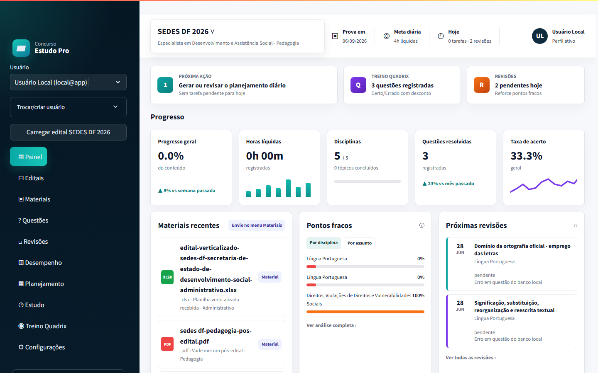

# Plataforma de Estudos para Concurso

MVP local para organizar edital, materiais, tópicos, estudo, questões, simulados e revisões. O teste inicial usa o edital `SEDES DF 2026` anexado e cadastra o cargo `Pedagoga/Pedagogia`.

## Prévia do dashboard



## Funcionalidades atuais

- Cadastro de concurso local.
- Seed do edital real SEDES DF 2026 para Pedagoga/Pedagogia.
- Inclusão do PDF pós-edital de Pedagogia como material de referência.
- Upload de PDF, DOCX, XLSX, CSV, TXT e imagens.
- Extração de texto de PDF, DOCX, Excel, CSV e TXT.
- OCR para imagens JPG/PNG com Tesseract OCR.
- Registro de sessões de estudo com horas líquidas.
- Programação automática de revisões D+1, D+7 e D+30.
- Fechamento automático de tarefas do plano ao registrar estudo ou questões do tópico.
- Registro de questões/simulados com feedback instantâneo.
- Banco local de questões objetivas por tópico do edital, com correção e revisão automática.
- Simulados com histórico e resultado por tópico.
- Planejamento diário e semanal com priorização automática.
- Relatório semanal exportável em Markdown.
- Dashboard com progresso, horas, desempenho, pontos fracos e volume de questões por bloco.
- Diagnóstico técnico do ambiente por script.
- Integração opcional com Ollama usando `gemma2:2b`.

## Limitações conhecidas

- Imagens são aceitas. OCR depende do Tesseract OCR instalado no Windows; nesta máquina ele foi instalado via `winget`.
- A IA local depende do Ollama rodando em `http://localhost:11434`.
- O modelo `gemma2:2b` é leve; serve para MVP, mas pode errar extrações longas ou complexas.
- O banco é SQLite local em `data/estudos.db`.
- A planilha verticalizada recebida está identificada como Administrativo; ela é arquivada como material, mas não substitui o mapa de Pedagogia.

## Roadmap

### v0.1.0 - MVP local publicado

- Dashboard de acompanhamento com progresso, horas, questões, pontos fracos e revisões.
- Upload e organização de edital e materiais de estudo.
- Extração de texto de PDF, DOCX, Excel, CSV, TXT e imagens com OCR.
- Banco local de questões e treino no estilo Quadrix.
- Planejamento diário/semanal, revisão automática e relatório semanal.
- Suporte opcional a IA local com Ollama `gemma2:2b`.

### Próximas versões

- Melhorar a tela de simulados com experiência questão por questão, cronômetro e resultado por bloco do edital.
- Criar visão detalhada por tópico com materiais vinculados, histórico de erros e revisão sugerida.
- Adicionar importação estruturada de bancos de questões em CSV/XLSX.
- Gerar relatórios em PDF para acompanhamento semanal.
- Evoluir o armazenamento local para sincronização opcional em PostgreSQL/Supabase.
- Empacotar uma versão desktop mais simples para uso por usuários sem familiaridade com terminal.

## Instalar no Windows

```powershell
cd C:\projetos\plataforma-estudos-concurso
.\scripts\install.bat
```

## Executar

```powershell
cd C:\projetos\plataforma-estudos-concurso
.\scripts\run.bat
```

O Streamlit abrirá no navegador, normalmente em:

```text
http://localhost:8501
```

## Diagnosticar o ambiente

Execute antes de uma rotina séria de estudos ou quando algo parecer quebrado:

```powershell
cd C:\projetos\plataforma-estudos-concurso
.\scripts\doctor.bat
```

O diagnóstico verifica compilação Python, banco SQLite, seed do concurso SEDES DF Pedagogia, tópicos, materiais, banco local de questões, fluxo diário integrado, OCR e Ollama.

## Testar telas principais

```powershell
cd C:\projetos\plataforma-estudos-concurso
.\scripts\smoke.bat
```

Para execução automatizada sem pausa:

```powershell
.\scripts\smoke.bat /nopause
```

## Criar atalho na Área de Trabalho

```powershell
cd C:\projetos\plataforma-estudos-concurso
powershell -ExecutionPolicy Bypass -File .\scripts\create_desktop_shortcut.ps1
```

## Usar com Ollama

Confirme que o modelo existe:

```powershell
ollama list
```

Se necessário, baixe:

```powershell
ollama pull gemma2:2b
```

Deixe o Ollama aberto antes de marcar a opção de análise por IA no upload.

## Ativar OCR de imagens

Instale o Tesseract OCR:

```powershell
winget install UB-Mannheim.TesseractOCR
```

Depois confira:

```powershell
cd C:\projetos\plataforma-estudos-concurso
.\scripts\check_ocr.bat
```

Para teste automatizado sem pausa:

```powershell
.\scripts\check_ocr.bat /nopause
```

## Teste manual recomendado

1. Execute o app.
2. Clique em `Carregar edital SEDES DF 2026`.
3. Abra o `Painel` e confira os tópicos de Pedagogia.
4. Abra `Configurações` e confira banco, OCR, IA local e quantidade de questões.
5. Abra `Planejamento > Semana` e gere uma semana com sua carga real.
6. Abra `Questões > Banco local`, responda pelo menos 10 questões e confira justificativa.
7. Registre uma sessão de estudo.
8. Registre uma bateria de questões com baixo desempenho.
9. Confira se aparecem pontos fracos e revisão programada.

## Rotina operacional recomendada

1. Abra `Planejamento` e gere o plano do dia com sua carga disponível.
2. Uma vez por semana, use `Planejamento > Semana` para montar o roteiro macro.
3. Execute as tarefas na ordem sugerida: revisões, questões e estudo novo.
4. Ao terminar cada bloco, registre a sessão em `Estudo`.
5. Resolva questões do `Banco local` e registre baterias reais em `Questões`.
6. Se errar ou ficar abaixo de 80%, o sistema cria revisão de reforço.
7. No dia seguinte, comece por `Revisões` e só depois avance para conteúdo novo.
8. Uma vez por semana, registre um simulado em `Questões > Simulado`.
9. Abra `Desempenho` e baixe o relatório semanal para revisar sua evolução.

## Rotina mínima para preparação real

- Segunda-feira: gerar plano semanal, zerar revisões vencidas e estudar tópicos de maior peso.
- Terça a sexta: cumprir plano diário, responder questões por tópico e registrar erros.
- Sábado: simulado parcial ou bateria longa por disciplina fraca.
- Domingo: revisar relatório semanal, ajustar pontos fracos e preparar a próxima semana.
- Todo dia: revisar primeiro, estudar novo conteúdo depois, resolver questões por último.

## Critério prático de aprovação

- Nenhum tópico prioritário sem primeiro contato.
- Revisões vencidas sempre zeradas.
- Pontos fracos abaixo de 70% revisitados até estabilizar acima de 80%.
- Simulados semanais registrados por disciplina.
- Pelo menos 4 horas líquidas em dias úteis, ajustável conforme rotina real.
- Taxa de acerto por disciplina acima de 80% antes da prova.
- Banco local com todos os tópicos cobertos, complementado por questões reais da banca quando disponíveis.
